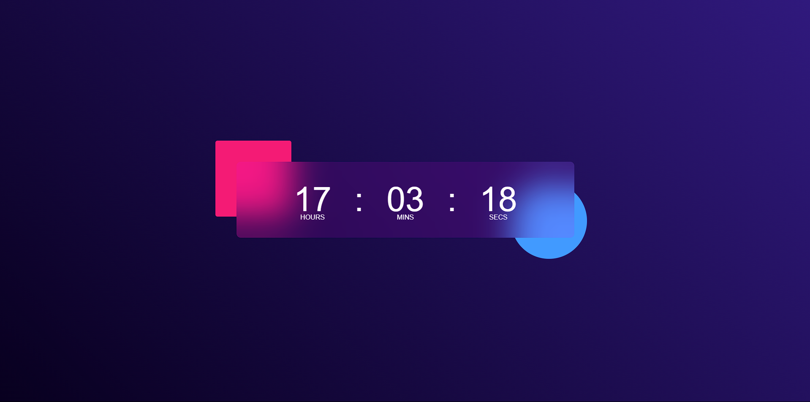

# Countdown Timer UI

This project features a modern **Countdown Timer UI** with a sleek and vibrant design, perfect for use in web applications or landing pages.

---

## 🖼 **Preview**



---

## 🚀 **Features**

- 🎨 **Modern Design**: Eye-catching gradient colors with smooth transitions.
- ⏱ **Time Display**: Shows **Hours**, **Minutes**, and **Seconds** clearly.
- 📱 **Responsive UI**: Adapts to various screen sizes for a clean user experience.
- ⚡ **Lightweight**: Minimal code, optimized for performance.

---

## 🛠 **Technologies Used**

- **HTML5**: To create the structure of the timer.
- **CSS3**: For styling, gradients, and layout.
- **JavaScript (ES6)**: Implements the countdown logic.

---

## 📦 **Project Setup**

1. **Clone the Repository**  
   ```bash
   git clone https://github.com/your-username/countdown-timer-ui.git
